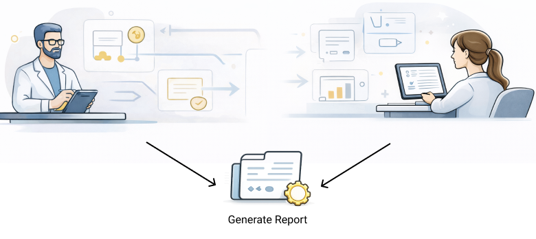
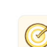
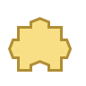

# Website Details Page Requirements

## Page Metadata
- Page name: `Website Details / Choose Path`
- Page slug: `website-details`
- Prototype source: `Requirements/Prototypes/website Details.png`
- Architecture references:
  - `Requirements/Architecture/01-Frontend-Architecture-Plan.md`
  - `Requirements/Architecture/ADR-004-Styling-System.md`

## 1) Prototype Image


## Goal of the Page
Allow users to choose between two workflows:
- design and evaluate a new system,
- evaluate an existing system.

The page must clearly explain both paths and their included steps, while preserving top navigation and footer consistency.

## UI Structure Breakdown (from prototype)
1. Top navigation bar
- Brand: `GamiDoc`
- Auth actions: `Log In`, `Sign Up`

2. Hero section
- Title: `Choose your Path`
- Subtitle: `Get started by selecting how you want to use GamiDoc for your project`

3. Workflow choice cards row (2 cards)
- Card A: `Design & Evaluate a New System` + CTA `Start Designing`
- Card B: `Evaluate an Existing System` + CTA `Start Evaluation`

Icons used in workflow cards:
- Card A icon file: `Codes/public/icons/choose-path/new-system.png`
  
- Card B icon file: `Codes/public/icons/choose-path/existing-system.png`
  

4. Mid-page workflow illustration/report block
- Two-side illustration scene + center report icon + arrows + `Generate Report` label
- Scene asset file: `Codes/public/images/choose-path/workflow-scene.png`
  

5. Workflow includes section
- Title: `What each workflow includes`
- Left column header: `For New Systems`
- Right column header: `For existing systems`

List item icons:
- Target/check icon: `Codes/public/icons/choose-path/target-check.png`
  
- Puzzle icon: `Codes/public/icons/choose-path/puzzle.png`
  
- Document/badge icon: `Codes/public/icons/choose-path/document-badge.png`
  
- Report icon (center block): `Codes/public/icons/choose-path/generate-report.png`
  

6. Footer
- Same 4-column footer structure as landing page

## 2) Graphical/Component Analysis

### 2.1 Reusable Components Already Available
Reusable shared components already available from landing implementation:
1. `components/ui/Button`
2. `components/ui/Card`
3. `components/ui/Container`
4. `components/ui/Grid`
5. `components/ui/SectionHeader`
6. `components/ui/TopNav`
7. `components/ui/FooterColumns`

Reusable style assets available:
1. `styles/tokens.css`
2. `styles/base.css`
3. `styles/utilities.css`

### 2.2 Components Needed for This Page
Likely new feature components under `modules/projects/components` (or equivalent selected domain):
1. `ChoosePathHero`
2. `WorkflowChoiceCards`
3. `WorkflowSceneBlock`
4. `WorkflowIncludesColumns`
5. `WorkflowIncludesItem`

Potential shared components to add if reuse is expected across upcoming pages:
1. `components/ui/InfoListPanel`
2. `components/ui/IconTextRow`

### 2.3 Reuse/Consistency Rules Applied
- No raw page-level button/card visual variants.
- Existing shared components must be reused first.
- Any new component used in 2+ pages must be promoted to shared UI.

## 3) Visual Asset Mapping (Mandatory)
1. New-system card icon
- Source asset path: `Codes/public/icons/choose-path/new-system.png`
- Asset origin: AI-generated from prototype style reference
- Rendering method: ``
- Target component: `WorkflowChoiceCards` (card A icon slot)

2. Existing-system card icon
- Source asset path: `Codes/public/icons/choose-path/existing-system.png`
- Asset origin: AI-generated from prototype style reference
- Rendering method: ``
- Target component: `WorkflowChoiceCards` (card B icon slot)

3. Workflow scene composite
- Source asset path: `Codes/public/images/choose-path/workflow-scene.png`
- Asset origin: cropped from `Requirements/Prototypes/website Details.png`
- Rendering method: ``
- Target component: `WorkflowSceneBlock`

4. Includes-list icon set
- Source asset paths:
  - `Codes/public/icons/choose-path/target-check.png`
  - `Codes/public/icons/choose-path/puzzle.png`
  - `Codes/public/icons/choose-path/document-badge.png`
- Asset origin: AI-generated from prototype style reference
- Rendering method: ``
- Target component: `WorkflowIncludesItem`

5. Center report icon
- Source asset path: `Codes/public/icons/choose-path/generate-report.png`
- Asset origin: AI-generated from prototype style reference
- Rendering method: ``
- Target component: `WorkflowSceneBlock`

Visibility requirement for all mapped assets:
- Assets must be visible without any user action.

## 4) Event List and Action Matrix

| Event ID | Trigger | Preconditions | Action | Expected Result | Error/Fallback |
|---|---|---|---|---|---|
| WD-E01 | Page open (`/choose-path`) | None | Call `GET /api/v1/auth/session` and `GET /api/v1/pages/choose-path` | Page renders with both workflow cards and includes section | If content API fails, show error state with retry |
| WD-E02 | Click `Log In` | Header rendered | Navigate to `/auth/login` placeholder | Login placeholder appears | If route missing, show toast and stay |
| WD-E03 | Click `Sign Up` | Header rendered | Navigate to `/auth/signup` placeholder | Sign-up placeholder appears | If route missing, show toast and stay |
| WD-E04 | Click `Start Designing` | Card A rendered | Navigate to `/design/context` (or final route selected later) | New-system workflow starts | If route missing, show toast and stay |
| WD-E05 | Click `Start Evaluation` | Card B rendered | Navigate to `/evaluation/review` (or final route selected later) | Existing-system workflow starts | If route missing, show toast and stay |
| WD-E06 | Footer link click | Footer rendered | Navigate to link target | Target page opens | Broken route -> 404 fallback |
| WD-E07 | Keyboard navigation | Focusable controls rendered | Tab/Shift+Tab/Enter/Space interactions | Full keyboard operability | Block release if focus order breaks |
| WD-E08 | Click retry after load error | Error state shown | Re-call `GET /api/v1/pages/choose-path` | Page recovers on success | Keep error message if retry fails |

## 5) API Requirements (Mini-Contracts)

### API-1: Session state
- Endpoint: `GET /api/v1/auth/session`
- Purpose: Determine auth UI controls in header.
- Request input: optional auth cookie/token
- Response success (200):
```json
{
  "isAuthenticated": false,
  "user": null,
  "allowedActions": ["login", "signup"]
}
```
- Response error:
```json
{
  "error": {
    "code": "SESSION_UNAVAILABLE",
    "message": "Unable to determine auth session"
  }
}
```
- Notes: mocked response served by lite backend.

### API-2: Choose-path page content
- Endpoint: `GET /api/v1/pages/choose-path`
- Purpose: Provide title, cards, includes lists, and footer content for this page.
- Request input: optional `lang=en`
- Response success (200):
```json
{
  "title": "Choose your Path",
  "subtitle": "Get started by selecting how you want to use GamiDoc for your project",
  "workflowCards": [
    {
      "id": "new-system",
      "title": "Design & Evaluate a New System",
      "description": "Create and evaluate a gamified system from scratch.",
      "cta": { "label": "Start Designing", "target": "/design/context" }
    },
    {
      "id": "existing-system",
      "title": "Evaluate an Existing System",
      "description": "Assess and document the evaluation of a system that is already implemented.",
      "cta": { "label": "Start Evaluation", "target": "/evaluation/review" }
    }
  ],
  "includes": {
    "newSystem": ["Define Context", "Select game elements", "Plan evaluation"],
    "existingSystem": ["Review system", "Select Methods", "Assess metrics"]
  }
}
```
- Response error:
```json
{
  "error": {
    "code": "CHOOSE_PATH_CONTENT_UNAVAILABLE",
    "message": "Choose-path page content is temporarily unavailable"
  }
}
```
- Notes: mocked response served by lite backend.

### API-3: Optional analytics
- Endpoint: `POST /api/v1/analytics/events`
- Purpose: track workflow CTA choices.
- Request input:
```json
{
  "eventName": "choose_path_cta_click",
  "page": "choose-path",
  "workflow": "new-system",
  "target": "/design/context",
  "timestamp": "2026-02-21T00:00:00Z"
}
```
- Response success (202):
```json
{ "accepted": true }
```
- Response error:
```json
{ "accepted": false }
```
- Notes: analytics failure must not block navigation.

## 6) Tests to Implement

### Unit tests
1. Hero renders title/subtitle exactly.
2. Workflow card component renders icon, title, description, and CTA.
3. Includes-list item renders icon + label for both columns.
4. Footer structure reuses shared component correctly.

### Integration tests
1. Route `/choose-path` fetches session + content APIs and renders all sections.
2. API failure renders error state and retry behavior.
3. CTA clicks navigate to expected targets.
4. Header auth actions navigate to placeholders.
5. Visual asset presence assertions for required icon/image blocks.

### E2E / Browser smoke tests
1. Open `/choose-path` and verify page is not blank.
2. Verify required visual assets are visible (cards icons + workflow scene + report icon).
3. Click `Start Designing` and `Start Evaluation`, validate routes.
4. Keyboard navigation and focus visibility checks.

## Open Items for Review
1. Confirm final workflow target routes:
- `/design/context` vs another route
- `/evaluation/review` vs another route
2. Confirm whether center report icon should remain separate from scene image at implementation time.
3. Confirm whether includes-list items are static text or should navigate to detail pages.

## Status
- This is a requirements/specification document only.
- Implementation must start only after explicit user approval.

## Visual Comparison Review Notes
Review date: 2026-02-21
Reference: side-by-side check against `Requirements/Prototypes/website Details.png` and implemented assets in `Codes/public/icons/choose-path/`

Checklist results:
1. `Codes/public/icons/choose-path/new-system.png`
- Status: `PASS`
- Notes: Core clipboard icon style is clean and consistent with prototype intent.

2. `Codes/public/icons/choose-path/existing-system.png`
- Status: `PASS`
- Notes: Monitor + checkmark style is clean and visually aligned.

3. `Codes/public/icons/choose-path/target-check.png`
- Status: `PASS`
- Notes: Clean generated icon, no crop artifacts.

4. `Codes/public/icons/choose-path/puzzle.png`
- Status: `PASS`
- Notes: Clean generated icon, no clipping.

5. `Codes/public/icons/choose-path/document-badge.png`
- Status: `PASS`
- Notes: Clean generated icon with consistent style.

6. `Codes/public/icons/choose-path/generate-report.png`
- Status: `PASS`
- Notes: Clean generated icon with consistent style.

Summary:
- Icon set now uses AI-generated clean assets based on prototype style.
- No cropping artifacts remain in implementation icon set.
